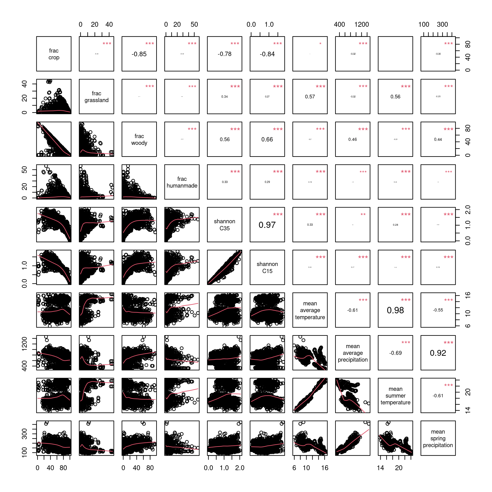

# fellow-gis

Research compendium for extracting spatial metrics around sampling sites.

Output data are stored in the Fellow Nextcloud WP2/Landscape_variables/

## Extracing landscape variables

#### 1. Land cover 

Land cover information comes from:  

> Zhang, X., Zhao, T., Xu, H., Liu, W., Wang, J., Chen, X., & Liu, L. (2023). GLC_FCS30D: The first global 30-m land-cover dynamic monitoring product with a fine classification system from 1985 to 2022 using dense time-series Landsat imagery and continuous change-detection method. Earth System Science Data Discussions, 2023, 1-32. <https://doi.org/10.5194/essd-16-1353-2024>

The global land cover product is derived from time-series Landsat imagery and utilizes a classification system of 35 land-cover categories. The data has a spatial resolution of 30m and a time span from 1985 to 2022. Data are available for download at <https://doi.org/10.5281/zenodo.8239305>


```r
source("analysis/01_get_GLC_FCS30D.R.R")
```

#### 2. Climate data

The climate data comes from: 

> Moreno A, Hasenauer H (2016). “Spatial downscaling of European climate data.” International Journal of Climatology, 1444–1458. <https://doi.org/10.1002/joc.4436>

The European climatic database offers high-resolution (1 km) monthly climate data available from 1950 to 2024. We use the [easyclimate R package](https://verughub.github.io/easyclimate/) to easily access the data. 

> Cruz-Alonso V, Pucher C, Ratcliffe S, Ruiz-Benito P, Astigarraga J, Neumann M, Hasenauer H, Rodríguez-Sánchez F (2023). “The easyclimate R package: Easy access to high-resolution daily climate data for Europe.” Environmental Modelling & Software, 105627. <https://doi.org/10.1016/j.envsoft.2023.105627>

```r
source("analysis/02_get_eayclimate.R")
```

#### 3. Merge landscape variables

```r
source("analysis/03_merge.R")
```




## Metrics definition

| Name                       | Definition                                                                                                                                                                                  | Unit           | Source      |
|----------------------------|---------------------------------------------------------------------------------------------------------------------------------------------------------------------------------------------|----------------|-------------|
| frac_crop                  | Fraction of crop land in the 1km buffer around the sampling site. Crop are identified as category 10, 11, 12 and 20 of GLC_FCS30D                                                           | %              | GLC_FCS30D  |
| frac_grassland             | Fraction of grassland in the 1km buffer around the sampling site. Grassland is identified as category 130 of GLC_FCS30D.                                                                    | %              | GLC_FCS30D  |
| frac_woody                 | Fraction of woody natural habitat in the 1km buffer around the sampling site. Woody natural habitats are identified as categories between 51 and 122 (forest and shrubbland) of GLC_FCS30D. | %              | GLC_FCS30D  |
| frac_humanmade             | Fraction of human-made cover in the 1km buffer around the sampling site. Artificial cover is identified as category 190 of GLC_FCS30D.                                                      | %              | GLC_FCS30D  |
| shannon_C35                | Shannon index of the 1km land cover calculated on the 35 classes of GLC_FCS30D                                                                                                              |                | GLC_FCS30D  |
| shannon_C15                | Shannon index of the 1km land cover calculated on the simplified 15 classes identified as the tens digits in GLC_FCS30D                                                                     |                | GLC_FCS30D  |
| mean_average_temperature   | average monthly temperature in the ten years period before the year of sampling                                                                                                             | degree celsius | easyclimate |
| mean_average_precipitation | average annual precipitation in the ten years period before the year of sampling                                                                                                            | mm             | easyclimate |
| mean_summer_temperature    | average summer temperature in the ten years period before the year of sampling                                                                                                              | degree celsius | easyclimate |
| mean_spring_precipitation  | average spring precipitation in the ten years period before the year of sampling                                                                                                            | mm             | easyclimate |
